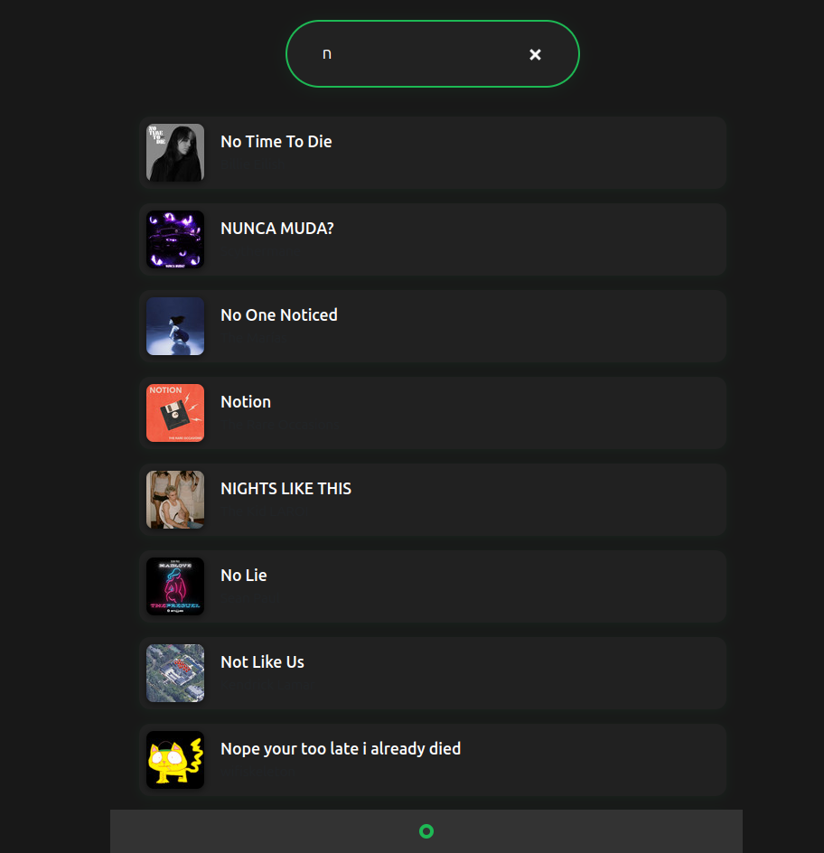

# Spotify Clone 🎵

>A modern Spotify web client clone built with React, Vite, and Node.js.



## Features
- Spotify authentication (OAuth)
- Search for tracks, artists, and albums
- Play tracks (Spotify Premium required)
- View lyrics for any track (via Genius API)
- Responsive, modern, Spotify-inspired UI

## Getting Started

### Prerequisites
- Node.js (v18+ recommended)
- Spotify Developer account ([create an app here](https://developer.spotify.com/dashboard))
- Genius API account ([get a token here](https://genius.com/api-clients))

### Setup
1. Clone this repo
2. Install dependencies:
   ```bash
   npm install
   cd server && npm install
   ```
3. In `server/server.js`, set your Spotify Client ID, Client Secret, Redirect URI, and Genius API token.
4. Start the backend:
   ```bash
   cd server
   npm run devStart
   ```
5. Start the frontend:
   ```bash
   npm run dev
   ```
6. Open [http://127.0.0.1:5173](http://127.0.0.1:5173) in your browser.

## Usage
- Click "Login with Spotify" and authorize the app.
- Search for any song, artist, or album.
- Click a track to view lyrics and play (Premium required for playback).


